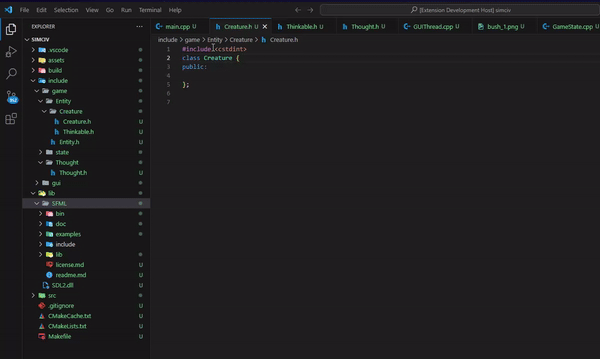

# VSCode C++ Include Helper Extension

## Overview

The **C++ Include Helper** extension for Visual Studio Code streamlines the process of adding `#include` directives to your C++ source files. As you type class names, it provides autocompletion suggestions and automatically inserts the appropriate `#include` directive at the top of your file.

## Features

1. **Automatic Workspace Analysis**:
   - The extension scans your workspace for C++ source (`.cpp`) and header files (`.h`, `.hpp`).
   - It identifies class names within these files and maps them to their respective file paths.
   - This analysis runs initially when the extension is activated and updates every 30 seconds to reflect any changes in your workspace.

2. **Class Name Autocompletion**:
   - While you type, the extension offers autocompletion suggestions for class names found in your workspace.
   - Selecting a class from the suggestions inserts a corresponding `#include` directive at the top of the current file, ensuring you never miss an essential include.

3. **Manual Workspace Analysis Command**:
   - You can manually trigger workspace analysis using the command palette (`Ctrl+Shift+P` or `Cmd+Shift+P`).
   - The command `Make Analysis` updates the class mappings immediately, which is particularly useful after adding new files or classes.

## Commands

- **Add Include**: Registers a command (`Add Include`) which is currently set up to show a message confirming the execution (primarily for demonstration purposes in this version).
- **Make Analysis**: Executes the `Make Analysis` command to scan and update the workspace class mappings on demand.

## How to Use

1. **Install the Extension**:
   - Install the extension from the Visual Studio Code marketplace or from a `.vsix` file.

2. **Activate the Extension**:
   - Open your C++ project in VSCode. The extension will automatically activate and start scanning your workspace.

3. **Start Typing**:
   - As you type a class name, the extension will suggest possible completions.
   - Select the appropriate class from the suggestions to insert its `#include` directive at the top of your file.

4. **Manual Analysis**:
   - You can manually trigger a workspace analysis by running the `Make Analysis` command from the command palette (`Ctrl+Shift+P` or `Cmd+Shift+P`).

## Installation

1. Download and install Visual Studio Code.
2. Search for "C++ Include Helper" in the VSCode marketplace and click "Install".
3. Alternatively, you can download the `.vsix` file and install it via `Extensions: Install from VSIX...` in the command palette.

## Contributing

Contributions are welcome! Feel free to open issues or pull requests on the [GitHub repository](https://github.com/your-repo-link).

## License

This project is licensed under the MIT License - see the [LICENSE](LICENSE) file for details.
